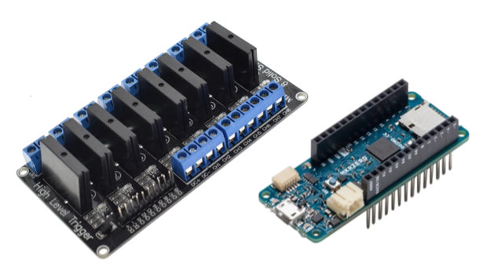
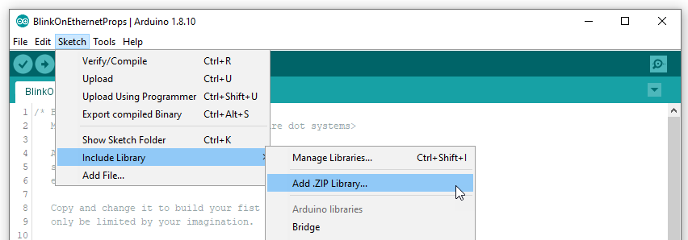
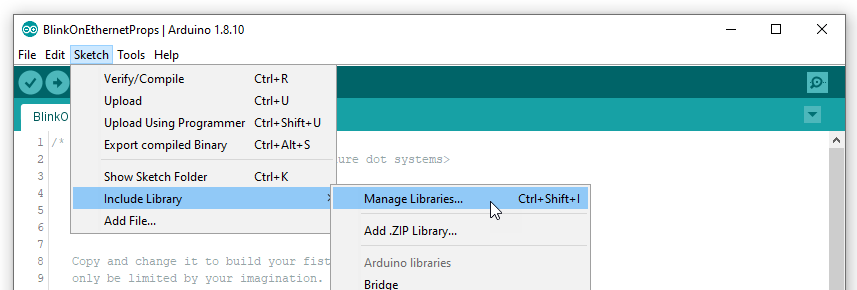

# Light effects with Arduino MKR WiFi 1010
*Tutorial – Audio and light effects (Part 2)*

Light effects are as important as audio effects for immersive experience.

Controlling lights requires a prop connected to the network to receive orders from *<a href="https://xcape.io/room/" target="_blank">Room</a>* via MQTT broker.

You can learn about <a href="https://xcape.io/props/" target="_blank">DIY props here</a> and get props source <a href="https://github.com/xcape-io" target="_blank">there on GitHub</a>.

We use an Arduino MKR WiFi 1010 to control 6 lights with a 8-relays SSR module:




## Prepare Arduino IDE
Download [ArduinoProps.zip](https://github.com/fauresystems/ArduinoProps/raw/master/ArduinoProps.zip) from GitHub and use **Sketch > Include Library > Add .ZIP Library...** 



Download library dependencies for Library Manager:
* ***PubSubClient***
* ***ListLib***




#### Update WiFiNINA firmware
For the Arduino MKR WiFi 1010, you may have to update the WiFiNINA firmware: [WiFiNINA firmware update](https://github.com/xcape-io/ArduinoProps/blob/master/help/WifiNinaFirmware.md).

## Customize the code for you network
Add `#include "ArduinoProps.h"` on top of your sketch and start coding.


If you're running our Escape Room control software *Room 2.0* to supervise the escape room in real-time you have to respect its syntax for inbox/outbnox MQTT topics: 
```csharp
Room/[escape room name]/Props/[props name]/inbox|outbox

example:
    Room/Demoniak/Props/Arduino Contrôleur/inbox
    Room/Demoniak/Props/Arduino Contrôleur/outbox
```

## Author

**Faure Systems** (Jun 26th, 2020)
* company: FAURE SYSTEMS SAS
* mail: *dev at faure dot systems*
* github: <a href="https://github.com/fauresystems?tab=repositories" target="_blank">fauresystems</a>
* web: <a href="https://faure.systems/" target="_blank">Faure Systems</a>